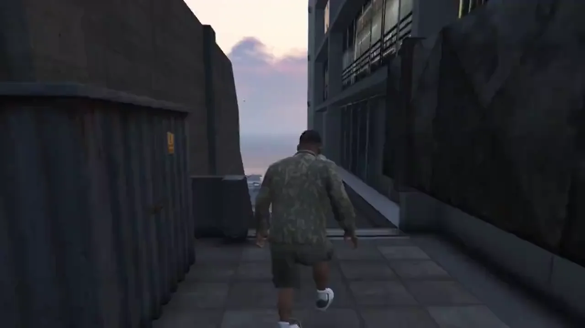

# SK8V

**Skate 3 gameplay. GTA V's open world.**


SK8V brings *Skate 3*'s Flick-It controls, board/skater physics, grinds, manuals, skitching, tricks, combos, bails, scoring, and Hall of Meat into **GTA V Legacy Story Mode**. Skate's gameplay runs alongside GTA's characters, traffic, weapons, radio, and world interactions. Skate 3’s own audio engine runs inside GTA’s mixer, so wheels sound different on every GTA surface. Things like concrete, asphalt, wood, metal, tile all sound different, and your wheels click over the cracks and seams in the pavement, with almost complete coverage.

## Requirements

- **Windows x64**, **GTA V Legacy 1.0.3889.0**, and **ScriptHookV v3889.0 / 1158.13** with its ASI loader.
- Your own Skate 3 Xbox 360 disc ISO or extracted disc folder (tested: title ID 454108E6, media ID 5C087C2C, no title update)
- About **7 GB free** on your GTA drive for setup; roughly **2 GB** remains afterward.

**Story Mode only.** GTA V Enhanced, GTA Online, and FiveM are not supported.

## Install

1. Download and extract the latest **SK8V release ZIP** from [Releases](../../releases/latest), **not** GitHub's Source code ZIP.
2. Close GTA V and run **`SK8V Setup.cmd`**. (If your GTA installation is in a protected folder (Program Files, etc.) setup will offer to restart as administrator.)
3. Select your Skate 3 disc, choose **Regular** or **Goofy** stance, and press **Install**. Setup detects your GTA V folder when possible.
4. Launch GTA V Legacy **Story Mode with BattlEye disabled**. Select the **skateboard** in GTA's weapon wheel, then press `Y` to mount it.

Setup prepares data from your copies of both games. It can download a local Python environment if needed, and rerunning it resumes interrupted preparation.

Command-line alternative (Python 3.11+, NumPy, Pillow):

```powershell
python tools/prepare.py --skate "<Skate 3.iso or folder>" --gta "<GTA V folder>" --stance Goofy --install --clean
```

(from the extracted release folder; omit --stance for Regular).

### Known Limitations & Future Support

- **Rockstar Editor:** Recording and playback are not currently functional with SK8V. Support is planned for a future update.

- **Teleporting while skating:** Teleporting directly while Skate mode is active may cause the skater to fall through the map. Switch back to GTA control before teleporting, then resume skating at your destination.

- **GTA V Enhanced:** SK8V currently supports GTA V Legacy only. Enhanced Edition compatibility is a long-term goal, but may require significant additional work and is not guaranteed.

## Controls

**All regular skating controls are Skate 3's.** SK8V adds:

| Input | Action |
|---|---|
| GTA weapon wheel → **Skateboard** | Enter Skate mode |
| `Y` / hold `Y` | Mount or dismount / put the board away and return to GTA |
| Keyboard `/` or controller `Back + LB` | Open SK8V menu |
| `Back` / hold `Back` | Equip or holster a weapon / open weapon wheel when armed |
| `LB` / `RB` when armed | Aim / fire |
| D-pad left/right, gun holstered | Change radio station |
| D-pad left/right, gun equipped | Change weapon |
| Double-tap `X` on foot near a grabbable wall | GTA mantle, then return to Skate |

Swimming switches to GTA automatically and returns to Skate afterward. **Hall of Meat is on by default** and can be disabled in the SK8V menu, alongside other gameplay settings.

## Uninstall

With GTA V closed, remove these from its folder:

- `SkateVLegacy.asi`, `SkateVRuntime.dll`, `SkateVLegacy.ini`, `SkateVLegacy.installed.json`
- `SK8V/`
- `update/x64/dlcpacks/skatev/`

Logs and records are in `%LOCALAPPDATA%\SkateV` and can be deleted separately. ScriptHookV is left untouched.

## Building from Source

Run BOOTSTRAP.bat to build the code, then follow BUILDING.md to package a release. The baked world collision data is copied from a published release.

## License

Original SK8V code is [Apache-2.0](LICENSE); third-party components keep their own licenses and are credited in [NOTICE](NOTICE). SK8V is an unofficial fan project, unaffiliated with EA, Rockstar Games, or Take-Two Interactive. No GTA V or Skate 3 retail assets, executables, keys, or proprietary SDK redistributables are included; supply your own game copies.

## Support Me
[](https://buymeacoffee.com/becaring) [](https://ko-fi.com/becaring)

If you had fun with SK8V, a donation is NEVER required but always appreciated <3 
